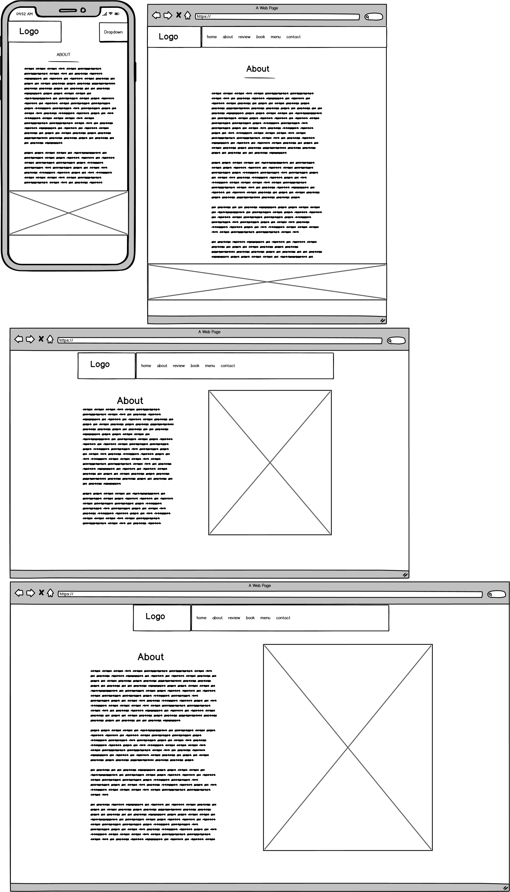
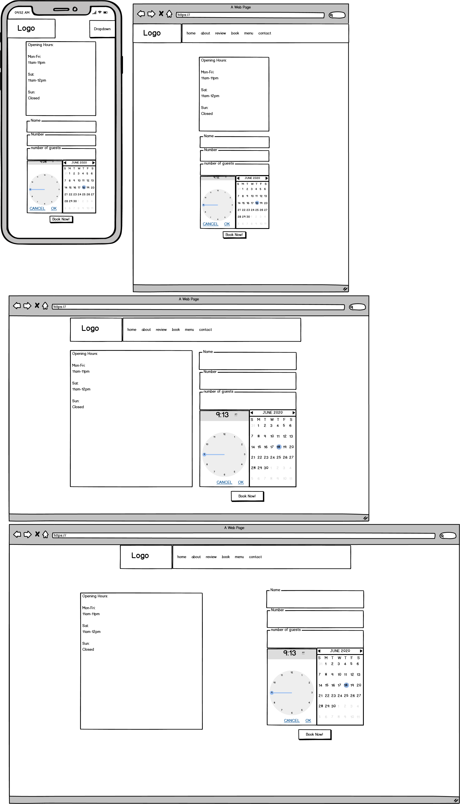
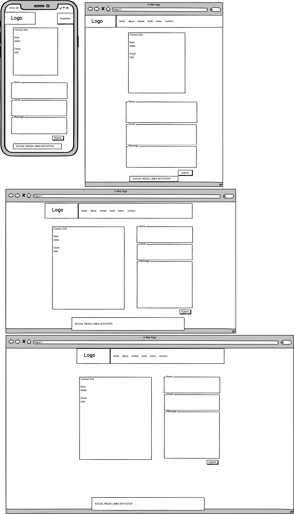
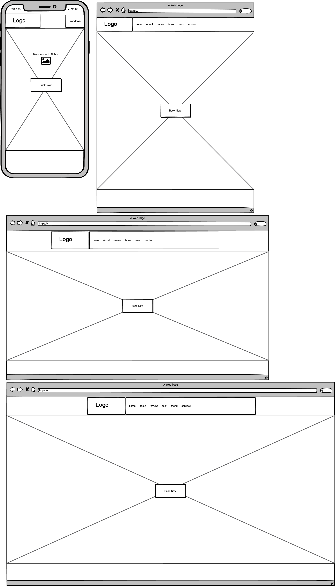
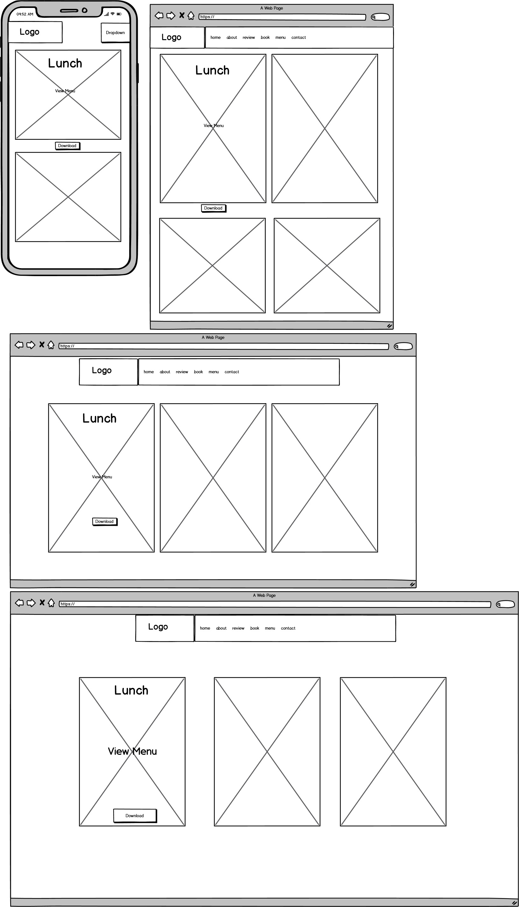
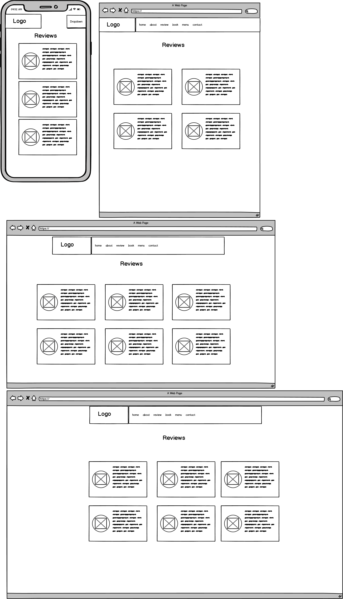

[The Pantry](https://mckenziemaude.github.io/the-pantry-project/)
 # Contents:
  * UX (User Experience):
    1. Aim of the project
    2. User stories
    3. Site Owner goals
  * Design:
    1. Font
    2. Color Scheme
    3. Logo and Icons
    4. Wireframing
    5. Images
  * Technologies Used:
    1. Languages
    2. Libraries, Frameworks & Programs
  * Features:
    1. Included Features
    2. Future Features
  * Testing:
    1. Validation
    2. Testing Against UX
    3. Further Testing:
      * Peer Review
      * Personal Browser Testing
  * Known Bugs:
    1. Bugs & Fixes
  * Deployment:
    1. Clone
    2. Fork
    3. GitHub Pages

# UX - (User Experience)
### Aim of the Project:
The aim of this project was to create a static website to promote a fictional restaurant. 
The aim was to create a visually appealing website which would allow users to find out more information about the restaurant and allow them to find information about the restaurant,
 it's menus, it's history, reviews and use the online forms to book tables and leave their own comments.
### User Stories:
* First-time users:
 1. As a first time user I would want to be greeted with a welcoming home page that is inviting and visually appealing.
 2. I want immediate access to information about the restaurant, booking and opening times.
 3.	I want to be able to read reviews and find information on services provided
 4.	I want the option to view menus online or download the menu to view offline
* Return users:
 1.	I would like access to booking to be quick and easy
 2.	I would like to be given access to information on any changes in the restaurant and menu changes
 3.	Possibility to add reviews to the site?
 4.	Information on events and updates, potential to sign up to newsletter?
* Site Owner:
 1. To provide information about the restaurant
 2. To promote the restaurant as a brand
 3. To allow customers to book through the website
 4. To allow the use of a newsletter format to provide additional information
# Design:
## Fonts: 
The fonts I have chosen to use for this project are !'Kaushan Script' and !'Open Sans'.
'Sans-serif' and 'cursive' are my alternative fallbacks.
I chose those fonts as they are complimentary of each other. Open Sans is the primary font used throughout the project. I felt that the font gives a professional look as well as offering a nice design, the spacing is naturally quite good as required very little in terms of styling, as well as being a good block text which allows for easy reading and doesn't confuse the user with difficult to read font.
The secondary font is Kaushan Script, I felt that for the logo and titles of the page they needed something with a little more flair and it was the perfect choice as it was visually more attractive and it added a rythmn to the logo and page titles open sans wouldn't have been able to produce.
The choice of Open sans and Kaushan in styling was bolstered by the fact that my default fonts for the page aren't too disimilar in terms of styling, and so I feel if there is a problem in loading the fonts for any reason then the styling off the project will still remain intact.

  Fonts Used from !Google Fonts!:
   

[Kaushan-Script](https://fonts.google.com/specimen/Kaushan+Script?query=kaush&sidebar.open&selection.family=Kaushan+Script)
 

[Open-Sans](https://fonts.google.com/specimen/Open+Sans?query=open&sidebar.open&selection.family=Kaushan+Script|Open+Sans:ital,wght@0,300;1,300)

## Color: 
  Primary - #042724D  
  Secondary - #363636 
  Supplementary - #000 
  Supplementary - #fff

  The primary color chosen is a dark forest green, this color makes up the majority of the color styling for the page, i chose this colour as I feel it was pleasing visually as well as creating a nice contrast against white elements and images on the page.
  The majority of elements feature some element of a white background as I wanted the colors to stand out from one another and add an air of professionalism to the project. I felt that the white also helped to create the best contrast for the logo image to help it really stand out against the white background.
  Supplementary colors were then used for the fonts and backgrounds to give visual impact, and give an ease to the user when reading information.
  I felt these were all complimentary colors and fit the themeing of the project aim to give a very natural feeling to the page to work with the natural imagery of the restaurant interiors.

## Logo and Icons: 
  All the icons I used in the project are from font awesome. I felt that the block style of social media icons were a better fit in the footer of the page as they fit into the grid style layout of the page.
  I felt that having icons in places was more appropriate than images as they give the visual impact of an image without the necessity to add more files to the repository. The icons are also very easily styled and sized to fit into the project nicely.

  The logo for the page I created myself using Gimp and a png file included in my credited section. The image is supposed to represent the roof of a house or farm style barn to incorporate the over-all theme of restaurant into the brand image.
  The fonts and colouring used in the logo are all incorporated into the color scheme of the page and I just felt it added to the project to give it a branded identity.

## Wireframes: 
  All of my wireframes were created in balsamic, I originally used pen and paper to sketch out a base idea for the page layout including the location of the navbar, footer and other content. 
  After an initial sketch of the ideas I created my designs using Figma (link), however upon getting further into the project and some suggestions from my mentor, i converted to balsamic. The approach was much quicker to produce wireframes with and gave me a good general idea of what i wanted to achieve with each page of my project.
  

    
About Page

       
  

  

    
Booking Page

       
  

  

    
Contact Page

       
  

  

    
Index Page

       
  

  

    
Menu Page

       
  

  

    
Review Page

       
  

## Images: 
The images that I used for this project were from a mixture of sources. The imagery of restaurant interiors and food pictures for use in the project, were all found through google image search.
 
Links to the images used in the project can all be found in the credits section. The images in their raw form weren't optimal for the project so I used Gimp which is an image editing software.
Gimp helped me use the images in a more optimal way by resizing images I used and helping me to create the logo.
(https://ya-webdesign.com/explore/roof-clipart-silhouette/)
(http://clipart-library.com/clipart/1841383.htm)
(https://www.independent.co.uk/life-style/food-and-drink/unhealthiest-chain-restaurant-desserts-britain-puddings-wetherspoon-toby-carvery-harvester-a7489171.html)
https://www.seriouseats.com/recipes/2014/12/the-best-slow-cooked-bolognese-sauce-recipe.html
https://www.foodtolove.co.nz/recipes/roast-pork-belly-with-caramelised-apples-13622
https://suitcasemag.com/travel/explore/londons-best-outdoor-restaurants/#jp-carousel-80754
https://gemlowes.com/2018/07/04/the-ivy-chelsea-garden/
https://aboutmanchester.co.uk/tripadvisor-fails-to-stop-highest-ranked-hotels-being-boosted-by-fake-reviews-which-finds/
https://www.facebook.com/ProfilePictures/
https://stackoverflow.com/questions/42401606/how-to-hide-collapsible-bootstrap-4-navbar-on-click

# Technologies Used:
## Languages:
  * [HTML 5](https://en.wikipedia.org/wiki/HTML5) - Core langauge used to create the project.
  * [CSS](https://en.wikipedia.org/wiki/Cascading_Style_Sheets) - Core language used to create the project styling.
  * [Java](https://en.wikipedia.org/wiki/JavaScript) - Personal written java was added through the project to solve an issue but was later removed to match brief.
## Libraries, Frameworks & Programs:
  * [Bootstrap](https://getbootstrap.com/) - Used bootstrap grid system for layout of the project and a lot of the components in the project itself.
  * [Bootstrap](https://getbootstrap.com/docs/4.5/getting-started/javascript/) - Imported Jquery & Java - Used for the modals and the collapsible navbar 
  * [Font-awesome](https://fontawesome.com/) - Used for icons in the project amd social icons in the footer.
  * [Google-Fonts](https://fonts.google.com/) - Used to pic font styles in the project and neccessary imports for styling.
  * [Gimp](https://www.gimp.org/) - Software used for image manipulation and editing.
  * [GitHub](https://github.com/) - Editor used for writing code and hosting/cloning project.
  * Google Chrome Dev Tools - Used for testing the project through each step and addition and quality control over the project through various devices.
  * [Balsamiq](https://balsamiq.com/?gclid=Cj0KCQjwoub3BRC6ARIsABGhnybyQV0_mB4Xg-I9n_9xWWt8z8qWrRcBoMWuL09Id8XUTHtMrp7_2FcaAjJsEALw_wcB) - Used to create wireframes for project.
  * [Figma](https://www.figma.com/) - Used to create wireframes for project.
## Browsers Used for testing:
  * Google Chrome
  * Mozilla firefox
  * Opera
  * Internet Explorer
## Features:
  *  Social media links in footer
  *  Responsive navbar
  *  Menu modals with download links
  *  Booking form
  *  Contact form
  *  Google maps frame
## Future Features:
  * Replace booking form with app for bookings
  * Add events page with carousel style layout for hosted events
  * Add button to homepage to include menu shortcut
  * Move to single scrolling page with use of Java to close navbar on link click.

# Testing:
##  Validation:
  * HTML Validation - I validated my HTML using the [W3C](https://validator.w3.org/#validate_by_input) Markup validator. This was useful in solidifying that my code had no errors, as well as a nice reminder to include Alt attributes for images and any unneccessary additions to code.
  * CSS Validation - I validated my CSS using the [W3C](https://jigsaw.w3.org/css-validator/#validate_by_input) CSS validator. Again to test for errors in code and correcting any extrenous mistakes.
## Testing against UX:
  Throughout the project testing was done using google chrome dev tools, mostly to see the changes I was making and the full effect they had.
  Testing from a user stand point was done through peer review and the reviews of family and friends. 
  As a first time user, they are greeted with an initial home page which is just a simple full image and a button. This is visually appealing and inviting and gives immediate access to the shortcut option to jump to bookings,
  or allows the user to use the Nav to find the information that they are after. All the information presented on the pages are in easy to read formats, the information is very easily accessed through the nav. And the menus from the modals are capable of being downloaded to give the users the option to keep the image and view it offline. 
  The reviews for the page are also included in a page of there own as to not confuse the pages with too much information and give a clear focused presentation to each section of the project. 
  For returning users, the booking button is the first thing that they are greeted with which gives immediate access to booking without the need to navigate through the site. 
  The open nature of the initial first page also gives the opportunity to add information such as "new changes" or "new menu" which gives the site owner opportunity to promote new changes or new events.
  The information on the reviews page can be consistently updated and the contact page has a message option to leave comments or reviews and gives the user a chance to opt into a newsletter which could then provide information on new changes,
  promotions or events that might be happening in the coming months.
  As a site owner, I feel the site is clear and very easily navigated, it gives easy access to information about the restaurant and menus. This helps to promote the restaurant with the inclusion of reviews and comments from customers.
  In terms of branding the theme of the site are all consistent and the logo on the navbar is fixed to the top of the page so no matter where the users are on the site they are always able to see the logo.
  and again the addition of a newsletter option in the contact form allows the owner to futher promote the restaurant with the addition of a newsletter that can be emailed to people that enter their information.
## Further testing: 
  The project as a whole was built through the git editor on my laptop and I used the google chrome dev tools throughout the project to inspect for any bugs or needed fixes. I had some friends and family review the project on various devices;
  including apple phones, android phones, laptops, tablets and desktops. For the most part the functionality of the site worked across all devices however there were a few sizing issues from some of the larger width mobile devices. 
  As i'd used the smallest breakpoint from bootstrap anything that was smaller or wider than that had a few spacing and sizing issues which were later corrected.
  Personally I also tested the site using Google chrome, Internet Explorer (Microsoft Edge), Opera and Mozilla Firefox. In doing so I wanted to test the supported features of the site and if there were any issues with how the page operated. However i didn't find any issues with the elements i used in my project.
  However after a small amount of research online I found that Opera and IE were probably the biggest risks in terms of non-supported elements, however with newer version they had much more supporting features.
## Known Bugs:
  As stated about in the testing there was a small issue with the modal menu buttons on the menu page resizing themselves and words wrapping around the image in a very unappealing way. However after this issue was made aware to me the correction was fixed with setting the buttons max-height/width in the css for the buttons.
  Other issues were predominantly typos and positioning issues using bootstraps grid system. However the issues had all been solved through the process of creating the project as I had DevTools to help me see what was happening with each line of code.

# Deployment:
The Pantry is a ficticious restaurant and the page was developed using GitPod and Github to host my repository.

When deploying my project I used Github Pages.
  1. Steps Made:
    * Navigated to my respository
    * In the top right corner of the page I found the setting tables
    * On the setting for the repository scroll down to find the github pages section
    * Selected the Masterbranch from the sources section.
